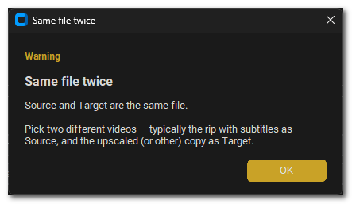
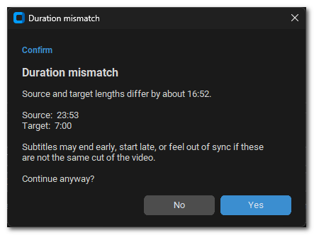
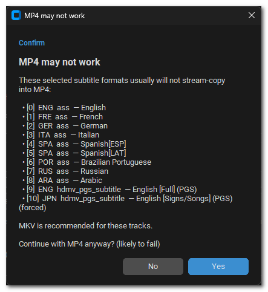

# Subtitle Muxer

Copy subtitle tracks from one video onto another — for example an original rip with softsubs onto an upscaled version that has none — with **no re-encoding** (stream copy).

Here’s the main window once a source, target, and subtitle tracks are loaded:

---

## Features

- Pick a **source** video (with subtitles) and a **target** video (video/audio to keep)
- Drag-and-drop or browse for files
- View every subtitle track (language, format, title) and choose which ones to copy
- Set a default **save folder** and filename (remembered between sessions)
- Output as **MKV** (recommended) or **MP4**
- Warns before muxing when source and target lengths differ a lot
- Warns when selected subtitle codecs are unlikely to stream-copy into MP4
- Blocks muxing if Source and Target are the same file, or if the destination would overwrite an input
- Watch FFmpeg progress in the built-in log panel
- FFmpeg is bundled — no separate install required for normal use

---

## Download

1. Open this repository’s **[Releases](https://github.com/CavemanTechandGamming/Subtitle-Muxer/releases)** page.
2. Download the file for your OS:
   - **Windows portable** — `…-windows-portable.zip` (extract and run the `.exe`)
   - **Windows installer** — `…-windows-setup.exe` (run the Setup wizard)
   - **Mac** — `…-mac-apple-silicon.tar.gz` or `…-mac-intel.tar.gz`
   - **Linux** — `…-<distro>.tar.gz` (e.g. `…-ubuntu.tar.gz`)
3. Extract if needed, then run **Subtitle Muxer**. No separate FFmpeg install is required for normal use.

---

## How to use

1. Load the **Source** video that already has the subtitles you want.
2. Load the **Target** video you want to keep (for example your upscaled file).
3. Select the subtitle tracks to copy, or leave **Select All** checked.
4. Choose a **Destination** folder and filename (or click **Same as target**). The destination section looks like this:

   

5. Pick **MKV** or **MP4**, then click **Mux Subtitles**.

That’s it — the target’s video and audio stay as-is; only the selected subtitle streams are added. When a run finishes cleanly, the log panel shows the result:

---

## Built-in checks

Before a mux starts, the app can pause on a couple of common problems so you’re not surprised later.

If **Source and Target are the same file**, muxing is blocked until you pick two different videos:

(The same idea applies if the destination path would overwrite the source or target file.)

If the source and target **lengths differ by more than a couple of seconds**, you’ll see a confirm dialog like this — continue if you know they’re the same cut, or cancel and double-check your files:

If you choose **MP4** and the selected tracks use formats that usually won’t stream-copy (ASS, PGS, and similar), you’ll get a warning that points you toward MKV:

You can still continue with MP4 if you want; the dialog is there so a failed mux isn’t a surprise.

---

## Tips

- Prefer **MKV** when possible. Some subtitle formats (ASS, PGS, and others) do not copy cleanly into MP4.
- Soft subtitle *tracks* can be copied. Burned-in subtitles, or closed captions baked into the video stream, cannot be extracted this way.
- If a track does not appear in the list, that file likely has no separate subtitle streams.

---

## License

MIT — see [LICENSE](LICENSE).

---

## Contributing

Want to build from source or send a pull request? See [CONTRIBUTING.md](CONTRIBUTING.md).
